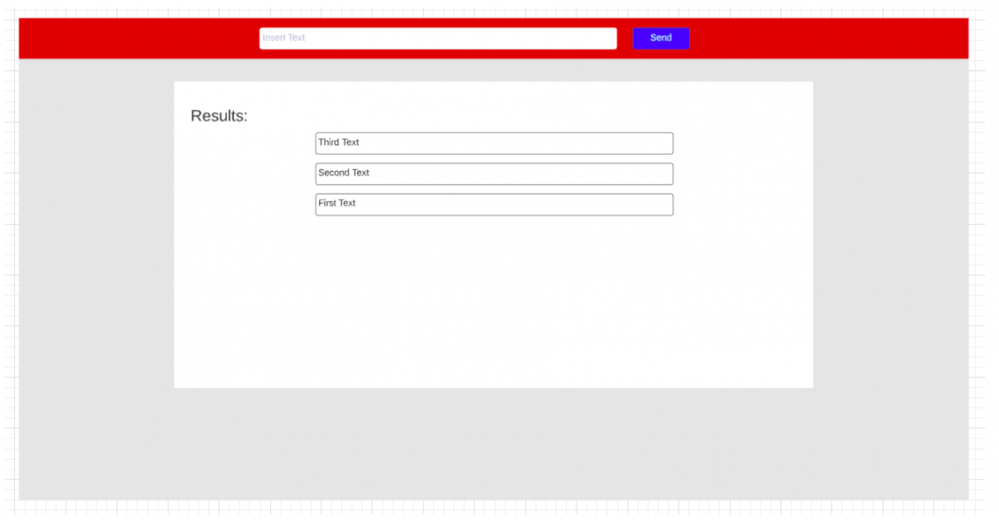
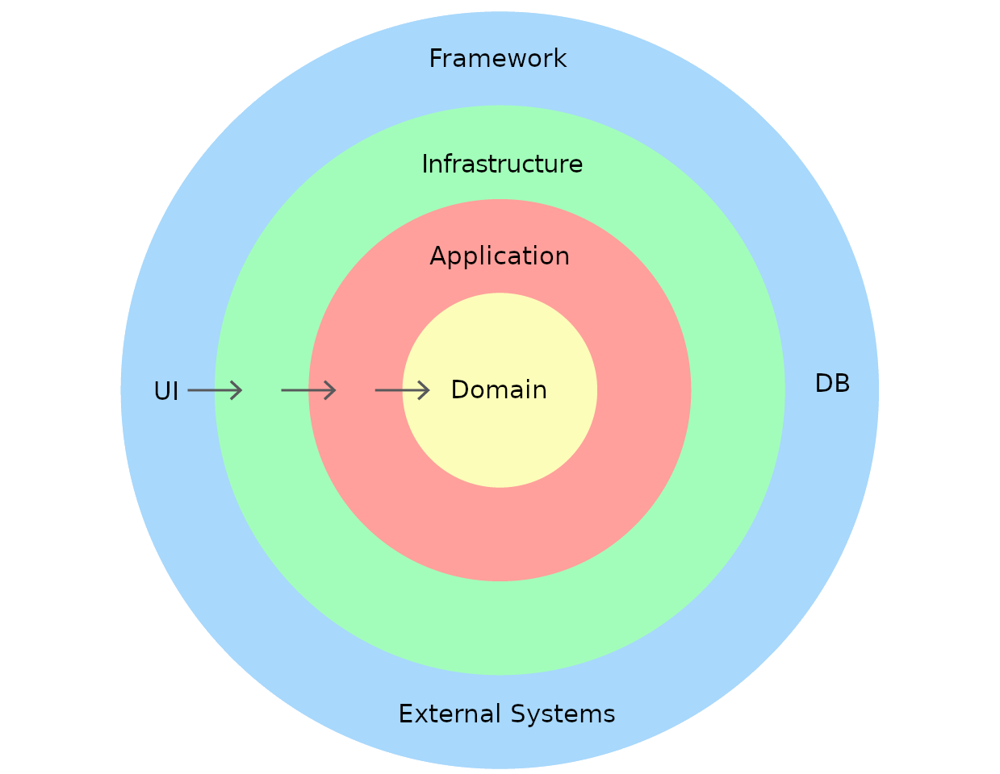
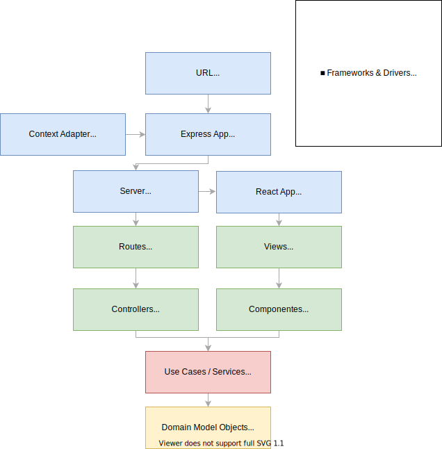

# Table of contents
- [Toolbox Technical Challenge](#toolbox-technical-challenge)
- [Running the project](#running-the-project)
- [Acceptance Criteria](#acceptance-criteria)
- [Architecture](#architecture)
  * [The Dependency Rule](#the-dependency-rule)
  * [Layers](#layers)
  * [Anatomy](#anatomy)
  * [Control flow](#control-flow)
- [API documentation](#api-documentation)
    + [Echo](#echo)
      - [Response](#response)

<small><i><a href='http://ecotrust-canada.github.io/markdown-toc/'>Table of contents generated with markdown-toc</a></i></small>


# Toolbox Technical Challenge


This repository contains my work submission for the technical code challenge by Toolbox.

[Read full challenge description here](./docs/challenge.md)


# Running the project

To run this project locally:

```
git clone https://github.com/erickruano/toolbox-technical-challenge.git
cd toolbox-technical-challenge
npm install
npm test
npm build
npm start
```

To deploy with Docker:

```
docker build . -t erickruano/toolbox-technical-challenge
docker run -p 3000:3000 -d erickruano/toolbox-technical-challenge
```

# Acceptance Criteria

|   ✅ Done  | 🟨 Work in progress | 🟥 Missing |
|------------|----------------------|-------------|
```

	- Functionality
		○ Backend
			○ ✅ Return inverted text
			○ ✅ Specify whether provided text is a palindrome
			○ ✅ Return error message if invalid text is provided
		○ Frontend
			○ ✅ Send text to iecho service on form submit
			○ ✅ Display responses from last to first
	- Documentation
		○ ✅ Project outline
		○ ✅ Instructions for running this project
		○ ✅ Project architecture
		○ ✅ API documentation
	- Technical requirements
		○ Backend
			- ✅ Node.js 12
			- ✅ ExpressJs
			- ✅ Mocha + Chai
			- ✅ Supertest
			- ✅ Self-contained
			- ✅ Utilizar JavaScript (ES6+) (y no TS, Dart, Elm, etc.)
			- Opcionales:
				□ ✅ Docker
				□ 🟨 StandardJS
		○ Frontend
			- ✅ Node.js 12
			- ✅ Webpack
			- ✅ React
			- ✅ Bootstrap
			- Opcionales:
				□ 🟥 Redux
				□ 🟥 Jest
```

# Architecture

Although in Clean Architecture implementations it is usually recommended to use folders to group code according to layers and architectural concepts, I decided the following:

- To split the frontend and backend contexts into their own separate folders and treat them as independent applications.
- To split the backend in `components`, each representing a domain entity that encloses all of the code for the three innermost layers.
- Use cases are contained in `services` for both backend and frontend, which are files that contain unitary pieces of application logic.
- I didn't use the Express 4 application generator, because it includes a lot of boilerplate that is not related to this project scope and introduces other concepts and practices such as logging, caching, etc.
- I did follow the folder structure of an Express 4 application so it can be easily extended in the future or even merged with a generated boilerplate (https://github.com/goldbergyoni/nodebestpractices/blob/master/sections/projectstructre/separateexpress.md).
- I didn't use Create React App since although I consider it a good practice, I wanted to avoid having a lot of boilerplate code unrelated to the challenge scope and keep a lean approach to the solution, as well as to demonstrate the ability to set up a project from scratch and configuring modern bundlers.
- For global and component-level styling, I went for a hybrid CSS Modules approach in which Webpack will process `*.css` as globals and `*.module.css` as CSS modules.

## The Dependency Rule

> The overriding rule that makes this architecture work is The Dependency Rule. This rule says that source  code dependencies can only point inwards. Nothing in an inner circle can know anything at all about > something in an outer circle. In particular, the name of something declared in an outer circle must not be mentioned by the code in the an inner circle. That includes, functions, classes. variables, or any other named software entity.

Althought this architecture is meant to follow the dependency rule, boundaries are broken between the Infrastructure and Adapter layers at the frontend because writing framework-agnostic views and components, to enable React to be interchangeable, would require a deeper level of abstraction on the markup.  Some dependency to Express is also present between the aforementioned layers (since routes are defined by using express).  Please note that this dependencies can be avoided if a project requires to do so by further abstracting the implementation. For the scope and stage of this project I decided this is an acceptable violation of boundaries.

## Layers



## Anatomy

|      Folder      | Purpose |
|----------------|---------|
| ./public     | Contains an `index.html` file that loads a `bundle.js` that is generated using webpack when the build command is run, as well as any other required static files.  |
| ./src     | Contains the source code for both frontend and backend applications  |
| ./bin     | Contains scripts that are required to run the application, including HTTP server that implements the backend application |
| **./src/api**   | **Backend** |  
|  ./src/api/app.js   | This file contains the Express Application
|  ./src/domain/components   | This folder will contain a sub-folder for each domain entity or any other domain concept that requires grouping code together |
|  ./src/domain/components/{domain_entity}   | This folder groups all the necessary files for a specific feature of the application |
|  ./src/domain/components/{domain_entity}/{feature}Service.js   | A `service.js` is a file that contains an application business logic unit.  It can also call enterprise business rules contained in entity classes / repositories |
|  ./src/domain/components/{domain_entity}/{request}Controller.js   | Controllers serve as entry point to the application logic layer.  They extract parameters from request, call required use cases and return an HTTP response |
|  ./src/domain/components/{domain_entity}/Repository.js   | Repositories hold the enterprise business logic and serve as entry point to the data persistence layer. |
|  ./src/domain/components/{domain_entity}/routes.js   | Each `routes.js` file should export an express Router with all routes associated to the domain entity or feature |
|  ./src/domain/components/{domain_entity}/index.js   | Index files import all the internal files of a component and export it they can be used by other parts of the application |
| **./src/web**   | **Frontend** |  
| ./src/web/layouts   | Contains a sub-folder for each layout the application requires |
| ./src/web/layouts/{layout}   | Contains the UI components and files that make up a layout |
|  ./src/web/views   | This folder contains all the views available in the application as sub-folders |
|  ./src/web/views/{view}   | This folder contains all the required components and services to make up a view |
| **./src/application**   | **Application layer** |  
|  ./src/application/services   | A service is a method that might get invoked by a controller.  Services contain application business rules or invoke enterprise business rules and use cases the domain layer |
| **./src/infrastructure**   | **Infrastructure layer** |  
|  ./src/infrastructure/views   | A view is a collection of templates and styles that implement React.js to provide an interface for the use cases to the users.  |

## Control flow



# API documentation

### Echo

HTTP Method | URL | Description | Query parameters |
------------ | ------------- | ------------- | ------------- | 
GET | /api/iecho | Returns reversed text | text  |

#### Response
```
{
    "text" : String,
    "reversedText": String,
    "isPalindrome": Boolean
}
```